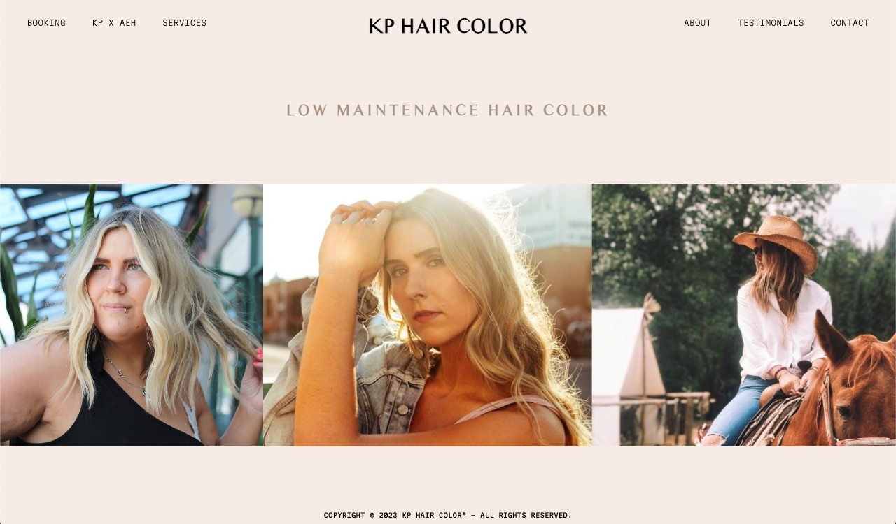
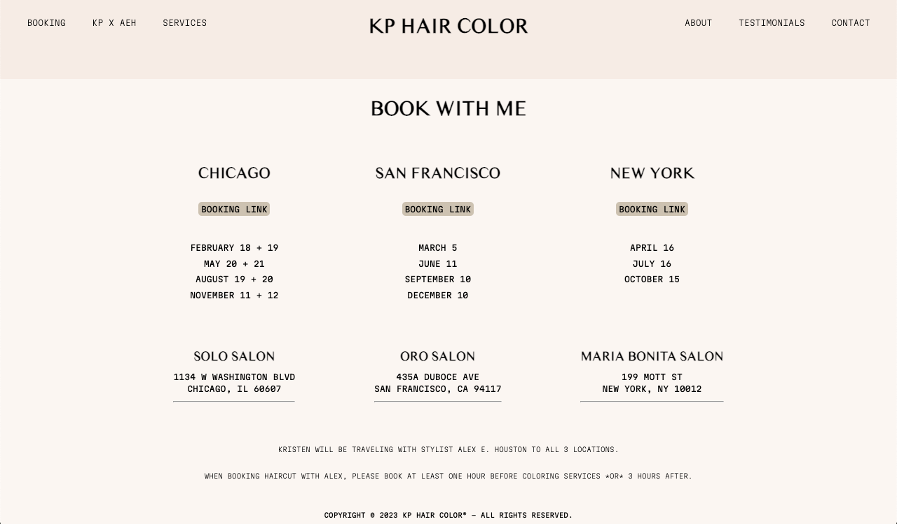
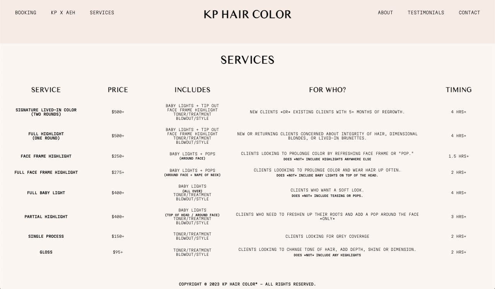
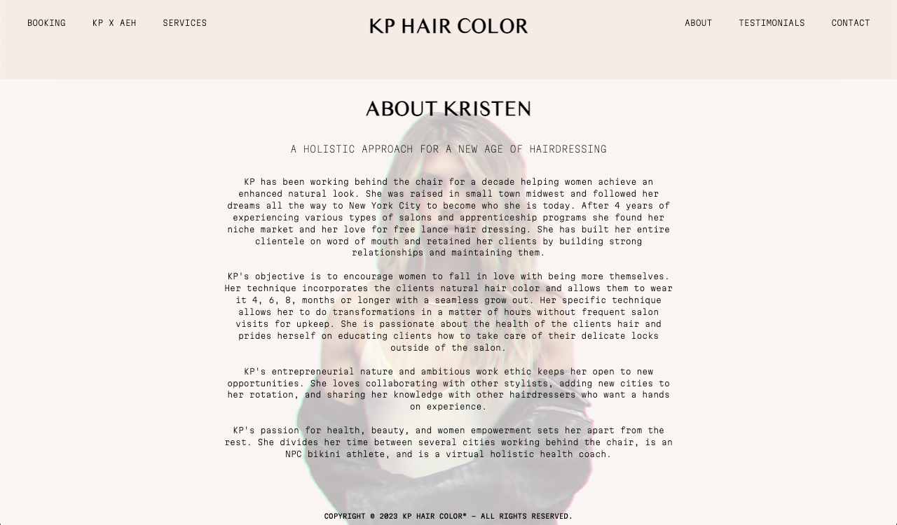
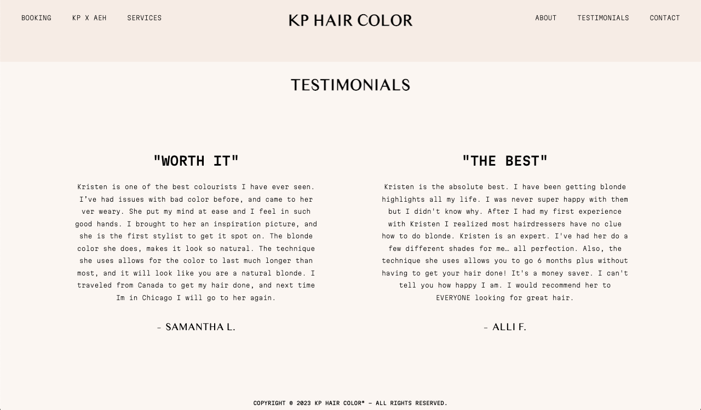

    

##### Created by <a href="https://alexehouston.github.io/portfolio/" target=”_blank”>Alex E. Houston</a>

 

# :pencil: Description

Kristen Pennington hairstylist with private cliente in Chicago, New York + San Francisco. Kristen's clients are able to navigate to this website in order to view a list of services, book appointments and keep in touch with KP Hair Color.

<a href="https://kphaircolor.netlify.app/" target=”_blank”>Deployed Link</a>

 

# :gear: Functionality

<h4 align="center">Home Page</h4> 

 
<h4 align="center">Booking</h4> 

 
<h4 align="center">Services</h4> 

 
<h4 align="center">About</h4> 

 
<h4 align="center">Testimonials</h4> 

 
<h4 align="center">Contact</h4> 

<!--  <h4 align="center">Mobile-View</h4> 

  
  &nbsp;&nbsp;&nbsp;&nbsp;&nbsp;&nbsp;&nbsp;&nbsp;
  
  &nbsp;&nbsp;&nbsp;&nbsp;&nbsp;&nbsp;&nbsp;&nbsp;
  

 -->

<!--  <h4 align="center">Tablet-View</h4> 

  
  &nbsp;&nbsp;&nbsp;&nbsp;&nbsp;&nbsp;&nbsp;&nbsp;
  
  &nbsp;&nbsp;&nbsp;&nbsp;&nbsp;&nbsp;&nbsp;&nbsp;
  

  -->

# :computer: Technologies Used

    
    
    

